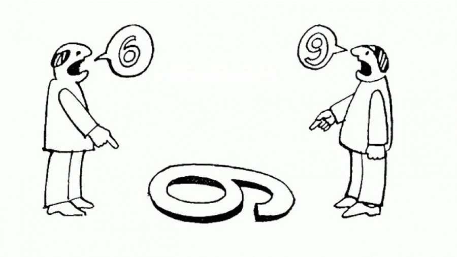
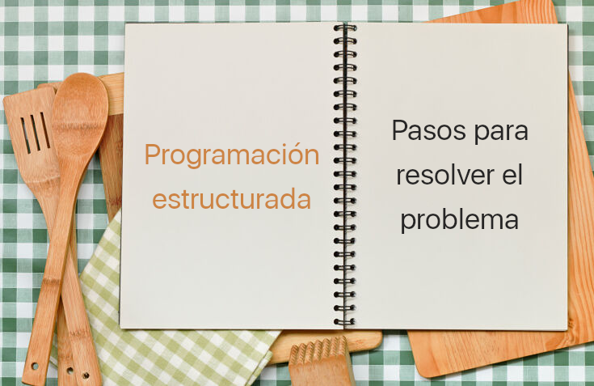
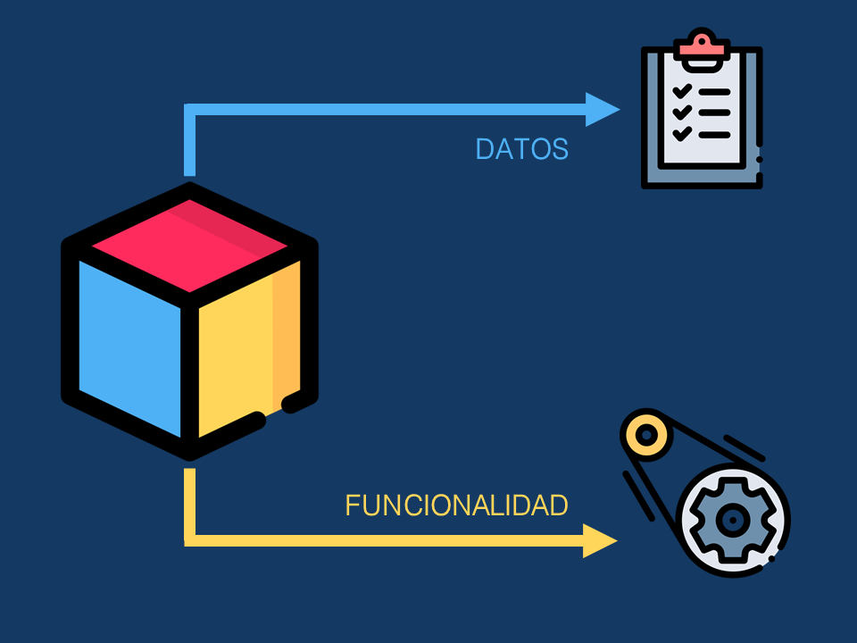
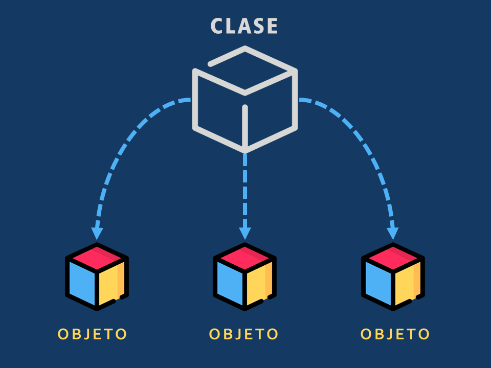
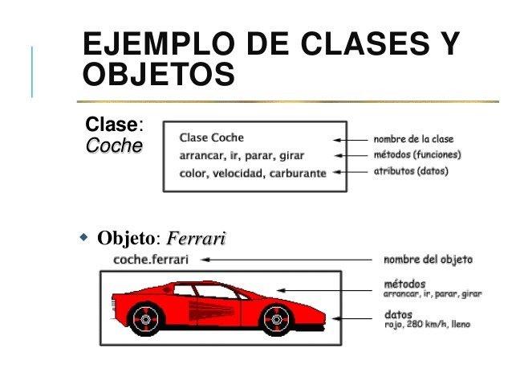
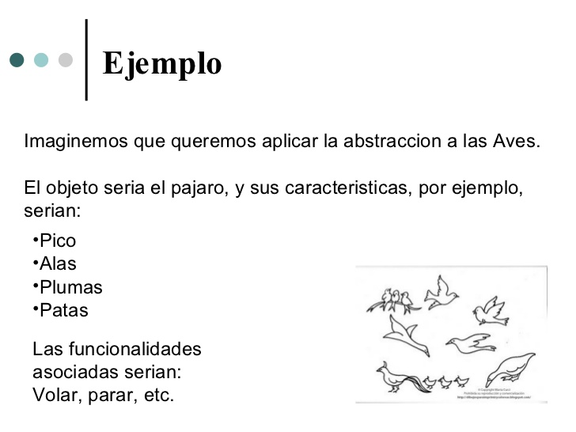

# Curso de Programación Orientada a Objetos. Instituto Tecnológico de Minatitlán.

## Tabla de contenidos

* [__Presentación del curso__](#presentación-del-curso)
  * [Motivo del curso](#motivo-del-curso)
  * [Beneficios de la programación](#beneficios-de-la-programación)
* [__Ejercicios de repaso__](#ejercicios-de-repaso)
* [__Introducción a la programación orientada a objetos__](#introducción-a-la-programación-orientada-a-objetos)
  * [Paradigma de programación](#paradigma-de-programación)
    * [Programación estructurada](#programación-estructurada)
    * [Programación orientada a objetos](#programación-orientada-a-objetos)
  * [Beneficios de la programación orientada a objetos](#beneficios-de-la-programación-orientada-a-objetos)
* [__Clases, métodos y atributos__](#clases-métodos-y-atributos)
  * [Clase](#clase)
  * [Objeto](#objeto)
* [__Abstracción__](#abstracción)
* [__Lenguaje unificado de modelado (UML)__](#lenguaje-unificado-de-modelado-uml)
  * [Diagrama de clases](#diagrama-de-clases)
* [__Clases y objetos__](#clases-y-objetos)
* [__Herencia__](#herencia)
* [__Polimorfismo__](#polimorfismo)

## Presentación del curso

### Motivo del curso

* Instruir a los alumnos de nuevo ingreso del ITM en el ambiente de la programación
* Enseñarles los fundamentos de programación orientada a objetos
* Incitarlos a que sean autodidactas
* Que conozcan la importancia de adquirir valor como profesionista

### Beneficios de la programación

* Estimula el pensamiento lógico
* Te ayuda a solucionar problemas de la vida real
* No te hará falta trabajo
* Es divertido

## Ejercicios de repaso

  
Ejercicio 1

  Escribir un programa que imprima "Hola mundo" en la pantalla.

  
Ejercicio 2

  Escribir un programa que salude a una persona _X_ por su nombre.

  
Ejercicio 3

  Escribir un programa que tome un número _n_ y muestre la sumatorio de 1 a _n_.

  
Ejercicio 4

  Modificar el programa anterior para que solo los números pares sean considerados.

  
Ejercicio 5

  
  Escribir un programa que muestre las tablas de multiplicar para los números del 1 al 12.

  
Ejercicio 6

  
  Escribir un programa que imprima los próximos 20 años bisiestos.

> https://adriann.github.io/programming_problems.html

## Introducción a la programación orientada a objetos

### Paradigma de programación

> Un paradigma de programación consiste en un método para llevar a cabo cómputos y la forma en la que deben estructurarse y organizarse las tareas que debe realizar un programa.
>
> Se trata de una propuesta tecnológica adoptada por una comunidad de programadores, y desarrolladores cuyo núcleo central es incuestionable en cuanto que únicamente trata de resolver uno o varios problemas claramente delimitados
>
> &mdash; <cite>[Wikipedia](https://es.wikipedia.org/wiki/Lenguaje_de_programaci%C3%B3n#Paradigma_de_programaci%C3%B3n)</cite>

En otras palabras: un paradigma de programación es un estilo de desarrollo de programas, con reglas y estándares predefinidos.

#### Programación estructurada

> Es el más usado en general, se basa en dar instrucciones al ordenador de como hacer las cosas en forma de algoritmos, en lugar de describir el problema o la solución. 
>
> Las recetas de cocina y las listas de revisión de procesos, a pesar de no ser programas de computadora, son también conceptos familiares similares en estilo a la programación imperativa; donde cada paso es una instrucción. Es la forma de programación más usada y la más antigua.
>
> &mdash; <cite>[Wikipedia](https://es.wikipedia.org/wiki/Lenguaje_de_programaci%C3%B3n#Paradigma_de_programaci%C3%B3n)</cite>

La programación estructurada es el paradigma con el que se enseña a programar.

#### Programación orientada a objetos

> __El paradigma de programación que actualmente es más utilizado es la "orientación a objetos" (OO)__. El núcleo central de este paradigma es la unión de datos y procesamiento en una entidad llamada "objeto", relacionable a su vez con otras entidades "objeto".
>
> &mdash; <cite>[Wikipedia](https://es.wikipedia.org/wiki/Lenguaje_de_programaci%C3%B3n#Paradigma_de_programaci%C3%B3n)</cite>

|                        |                       |
| ---------------------- | --------------------- |
|  |  |

La programación orientada a objetos introduce un grado de complejidad al diseño de programas ya que no solo se requiere de una serie de pasos para resolver el problema sino una separación de los diferentes elementos que componen la solución.

### Beneficios de la programación orientada a objetos

* Permite __modularizar el código__ diviendo así las responsabilidades en diferentes objetos, en vez de tener toda la solución en un mismo sitio haciendo el código difícil de mantener.
* Permite la __reutilización de código__. Es decir, evita que tengamos que reescribir la misma solución a un problema varias veces.
* Permite __modelar los elementos del mundo real__ en nuestros programas de manera efectiva, lo cual permite diseñar soluciones eficaces.

## Clases, métodos y atributos

### Clase

> En informática, una clase es una plantilla para la creación de objetos de datos según un modelo predefinido. Las clases se utilizan para representar entidades o conceptos, como los sustantivos en el lenguaje. Cada clase es un modelo que define un conjunto de variables -el estado, y métodos apropiados para operar con dichos datos -el comportamiento. Cada objeto creado a partir de la clase se denomina instancia de la clase.
>
> &mdash; <cite>[Wikipedia](https://es.wikipedia.org/wiki/Clase_(inform%C3%A1tica))</cite>

### Objeto

> En el paradigma de programación orientada a objetos (POO, o bien OOP en inglés), un objeto es una unidad dentro de un programa de computadores que consta de un estado y de un comportamiento, que a su vez constan respectivamente de datos almacenados y de tareas realizables durante el tiempo de ejecución.
>
> &mdash; <cite>[Wikipedia](https://es.wikipedia.org/wiki/Objeto_(programaci%C3%B3n))</cite>

Los métodos constituyen el comportamiento de los objetos, mientras que los atributos constituyen sus características.

## Abstracción

> La abstracción es una operación mental destinada a aislar conceptualmente una propiedad o función concreta de un objeto, y pensar qué es, ignorando otras propiedades del objeto en cuestión.
>
> &mdash;<cite>[Wikipedia](https://es.wikipedia.org/wiki/Abstracci%C3%B3n_(filosof%C3%ADa))</cite>

## Lenguaje unificado de modelado (UML)

> Es un lenguaje gráfico para visualizar, especificar, construir y documentar un sistema. UML ofrece un estándar para describir un "plano" del sistema (modelo), incluyendo aspectos conceptuales tales como procesos, funciones del sistema, y aspectos concretos como expresiones de lenguajes de programación, esquemas de bases de datos y compuestos reciclados.
>
> &mdash; <cite>[Wikipedia](https://es.wikipedia.org/wiki/Lenguaje_unificado_de_modelado)</cite>

### Diagrama de clases

> En ingeniería de software, un diagrama de clases en Lenguaje Unificado de Modelado (UML) es un tipo de diagrama de estructura estática que describe la estructura de un sistema mostrando las clases del sistema, sus atributos, operaciones (o métodos), y las relaciones entre los objetos.
>
> &mdash; <cite>[Wikipedia](https://es.wikipedia.org/wiki/Diagrama_de_clases)</cite>

Es la representación gráfica empleada para modelar sistemas de software.

## Clases y objetos
  
  * Declaración de clases: atributos, métodos y encapsulamiento
  * Instanciación de una clase
  * Métodos: declaración, paso de mensajes, paso de parámetros, retorno de valores
  * Constructores y destructores
  * Sobrecarga de métodos

## Herencia

> En programación orientada a objetos, la herencia es, después de la agregación o composición, el mecanismo más utilizado para alcanzar algunos de los objetivos más preciados en el desarrollo de software como lo son la reutilización y la extensibilidad. A través de ella, los diseñadores pueden crear nuevas clases partiendo de una clase o de una jerarquía de clases preexistente (ya comprobadas y verificadas) evitando con ello el rediseño, la modificación y verificación de la parte ya implementada. La herencia facilita la creación de objetos a partir de otros ya existentes e implica que una subclase obtiene todo el comportamiento (métodos) y eventualmente los atributos (variables) de su superclase.
>
> &mdash; <cite>[Wikipedia](https://es.wikipedia.org/wiki/Herencia_(inform%C3%A1tica))</cite>

Una clase base es la clase a partir de la cual se heredarán otras clases, y las clases que heredan se les conoce como clases derivadas.

* Reutilización de miembros heredados
* Instanciación de una clase derivada
* Redefinición de métodos en clases derivadas

## Polimorfismo

> En programación orientada a objetos, el polimorfismo se refiere a la propiedad por la que es posible enviar mensajes sintácticamente iguales a objetos de tipos distintos. El único requisito que deben cumplir los objetos que se utilizan de manera polimórfica es saber responder al mensaje que se les envía.
>
> &mdash; <cite>[Wikipedia](https://es.wikipedia.org/wiki/Polimorfismo_(inform%C3%A1tica))</cite>

* Clases abstractas
* Interfaces
