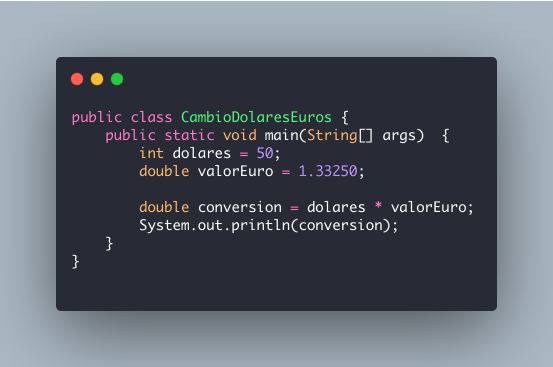
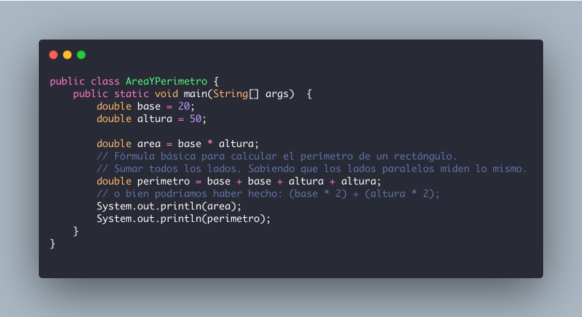
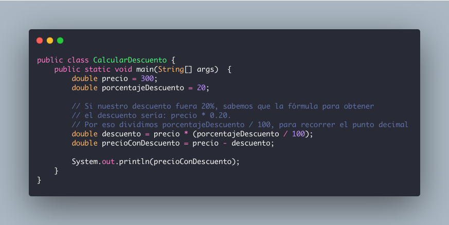
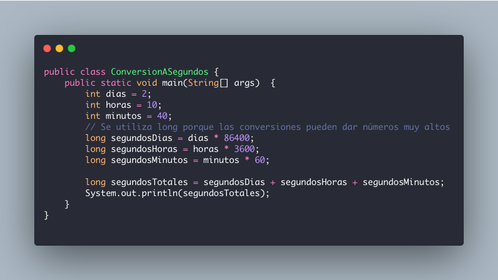
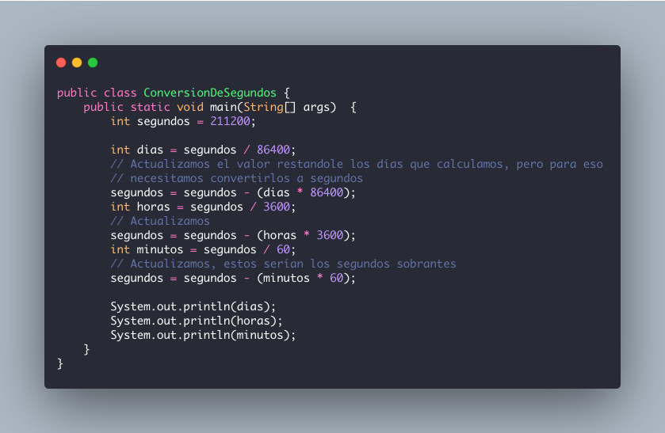

# Ejercicios de repaso

* __Cambio de dólares a euros__

  Suponiendo que 1 euro = 1.33250 dólares. Escribe un programa que, dada una cantidad de dólares, calcule el cambio en euros y lo muestre en pantalla.

  

  
 Ver respuesta 

  
  

* __Cálculo de área y perímetro__

  Dadas la base y la altura de un rectángulo, hacer un programa que calcule el área (base por altura) y el perímetro (suma de los lados) y los muestre en pantalla.

  

  
 Ver respuesta 

  
  

* __Cálculo de precio con descuento__ 

  Dado el precio de un producto y su porcentaje de descuento, hacer un programa que cacule el precio con el descuento y mostrarlo en pantalla. Por ejemplo, si el precio es 300 y el descuento es 20, el programa debe mostrar 240.

  

  
 Ver respuesta 

  
  

* __Convertir días, horas y minutos a segundos__

  Dados los días, las horas y los minutos, hacer un programa que muestre en pantalla la cantidad de segundos __totales__ que son esos datos.  
  | Dato     | Equivalencia      |
  | -------- | ----------------- |
  | 1 dia    | 86400 segundos    |
  | 1 hora   | 3600 segundos     |
  | 1 minuto | 60 segundos       |

  Ejemplo: 2 días, 10 horas y 40 minutos equivalen a 211,200 segundos.  

  

  
 Ver respuesta 

  
  

* __Convertir segundos a días, horas y minutos__

  Dados los segundos, hacer un programa que exprese __la misma cantidad de segundos__ pero convertidos a días, horas y minutos.  
  Ejemplo: 211,200 segundos equivalen a 2 días, 10 horas y 40 minutos.  

  

  
 Ver respuesta 

  
  

  [Fuente](http://www.cartagena99.com/recursos/programacion/ejercicios/PROGRAMACION_EN_LENGUAJE_C.pdf)
